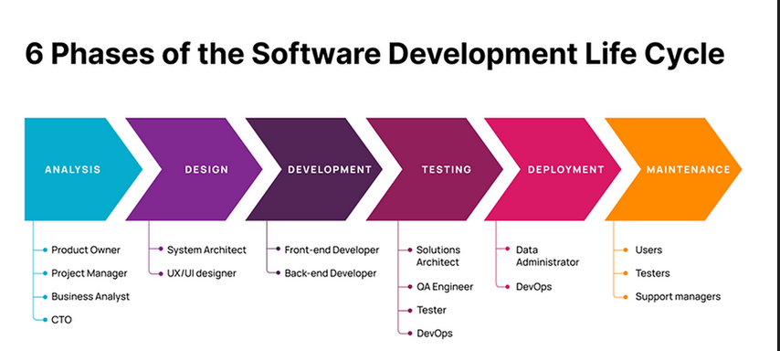

## 1. Why is software testing  important?
- Ensures software quality and reliability 
- Consequences can be severe, even life threatening: medical field
#
## 2. Basic concepts:
- Bugs (code defect/unexpected behaviour)
- Errors (human action/producing incorrect result)
- Failures (software unable to perform intended function/ outcome of bug or error)
#

## 3. Aim of software testing
- To identify and fix Bugs, Errors and Failures
#
## 4. Goals of software testing (validation, verification & compliance)
- Validate software meets requirements
- Verify correct functionality
- Identify areas of improvement to improve quality and reliability of the software application
- Addtionally, assess usability, performance and security (outside the basic function)
- Complies with industry standards (IEC 62304 etc.) and legal regulations (MDR)

#

## Testing as part of SDLC (software development life cycle)
- From initial planning, to final deployment of the software product
- Stages includes: 
- [ ] Requirements analysis 
- [ ] Design implementation 
- [ ] Testing and Deployment
- Testing carried out at all stages of SDLC  

#
## Software bugs examples in the real world
- NASA Mars climate orbiter
#

## Software Development life cycle (SDLC overview)
- Process of producing and maintaining software systems
- Primary goals of SDLC:
- [ ] High quality
- [ ] Meet customer expectations
- [ ] On time & within budget

#
## SDLC process and phases
1. Requirements /Analysis: gather and define funtional and non-functional project foundation.
2. Design: determine architectual structure documents
3. Implementations /development: Product coded & built to specifications
4. Testing: Fix bugs, errors & inconsistencies
5. Deployment: Public release, inc. user training, log files/documentation
6. Maintenance: Support, big fixes, updates etc. 

#
## Role of Testing in SDLC
- Ensures quality and reliability
- Occurs throughout development process
- Identify & fix defects early
- Prevents mistakes, reduces risk of failure
#
## testing in different SDLC phases
1. Requirements: validate & verify that requirements are clear and complete with stakeholder
2. Design: check documents are accurate and consistent (feedback about risks)
3. Implementation: develop test cases according to design documents, run unit Testing
4. Testing: execute test cases, identify defects in softwares & retest before release 
5. Deployment: testers involved in verify correct, provide support material
6. Maintenance: test new features, bug fixes and changes
#
## Summary
- Testing ensure software is reliable and defect free
- Testing throughout the SDLC minimises risk of software failure
#

## Add the pdf here